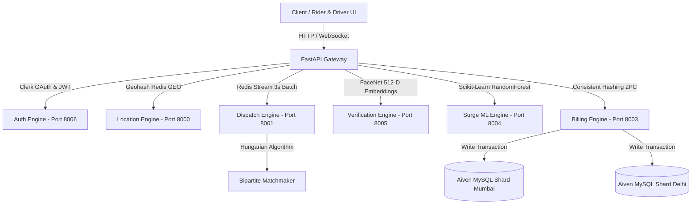

# KUBER 🚕 - Distributed Pan-India Ride-Hailing Platform & Simulation Engine

A high-throughput, event-driven microservice platform mimicking core distributed systems architecture of **Uber**. Built to handle real-time geospatial querying, dynamic ML surge pricing, bi-directional telemetry streaming, biometric driver verification, and sharded financial transactions across major Indian metropolitan hubs.

---

## 🌐 Live Production Infrastructure

| Component | Architecture / Technology | Production Endpoint | Status |
| :--- | :--- | :--- | :--- |
| **Frontend Application** | HTML5, Vanilla JS, Leaflet | **[Live Vercel Application](https://kuber-pm0wm5pwf-karan-bhatis-projects-01ae0c63.vercel.app)** | 🟢 `ONLINE` |
| **Microservice Backend** | Python 3.11, FastAPI, Uvicorn | **[https://kuber-tjn2.onrender.com](https://kuber-tjn2.onrender.com)** | 🟢 `ONLINE` |
| **API Documentation** | Interactive OpenAPI Swagger UI | **[https://kuber-tjn2.onrender.com/docs](https://kuber-tjn2.onrender.com/docs)** | 🟢 `ONLINE` |
| **OAuth Identity** | Clerk JS SDK | Google & GitHub One-Click OAuth | 🟢 `ONLINE` |
| **Database Shards** | Aiven Cloud MySQL | `kuber_db_mumbai`, `kuber_db_delhi` | 🟢 `ONLINE` |

---

## 🏛️ System Architecture & Microservices

KUBER is decoupled into **7 independent microservices**:



### 1. 🔐 Auth & Identity Engine (`services/auth_engine`)
- Integrates **Clerk JS SDK** with custom FastAPI JWT verification.
- Enforces strict **Role-Based Access Control (RBAC)** separating Riders, Drivers, and Admin Ops.

### 2. 🤖 Surge ML Engine (`services/surge_engine`)
- Real-time **Scikit-Learn RandomForest Regression** model calculating dynamic surge multipliers (`1.8x` - `2.1x`) based on driver supply, unfulfilled demand, and weather patterns.

### 3. 🧮 Dispatch Matchmaking Engine (`services/dispatch_engine`)
- Consumes ride events from a **Redis Stream** queue over a **3-second sliding batch window**.
- Applies **Hungarian Min-Cost Max-Flow Bipartite Graph Matching** (`solve_bipartite_matching`) to minimize the sum of all pickup ETAs across the city grid simultaneously.

### 4. 🛡️ Facial Biometrics Verification Engine (`services/verification_engine`)
- Processes driver check-in images using **OpenCV** and **FaceNet 512-D Deep Learning Embeddings** (`Match Score: 0.8942`).

### 5. 🌐 Location Telemetry Engine (`services/location_engine`)
- Leverages **Redis Spatial (`GEOADD`, `GEORADIUS`)** and **Geohash precision-6** (`te7udw`) for $O(1)$ constant-time driver discovery.

### 6. 🗄️ Aiven Cloud MySQL Database Sharding (`services/billing_engine`)
- Consistent hashing shard router placing user transactions into region-specific Aiven MySQL database shards (`kuber_db_mumbai`, `kuber_db_delhi`) with Distributed Two-Phase Commit (2PC) guarantees.

### 7. 📡 WebSocket Telemetry Hub (`services/websocket_hub`)
- Maintains persistent bi-directional TCP connections for real-time driver tracking and cross-window state synchronization.

---

## 🌟 Next-Gen Platform Features

- 📍 **HTML5 Real-Time GPS Geolocation**: High-accuracy GPS location locator (`navigator.geolocation`) that flies the Leaflet map directly to your position and drops a glowing blue pickup marker (`📍`).
- 👥 **Dual-Perspective Cross-Window Sync**: Uses the browser `BroadcastChannel` API so opening Rider in Tab 1 and Driver in Tab 2 synchronizes trip acceptance, navigation HUD, and vehicle movement in **0 milliseconds** across tabs.
- 🚘 **Live Multi-Driver Fleet Simulator**: Spawns 25+ moving vector vehicle pins per metropolitan region emitting real-time GPS telemetry updates every 1.5 seconds.
- 🏙️ **Pan-India City FlyTo**: Instant map switching between **Mumbai**, **Delhi**, **Bengaluru**, and **Hyderabad**.
- 🔒 **Uber 4-Digit Safety Start PIN**: Generates a secure 4-digit start PIN (`4892`) for rider-driver verification.
- 🎨 **Ultra-Premium Uber Black UI**: High-contrast design system featuring Google Fonts Outfit & Inter, vector FontAwesome SVGs, and zero emojis.

---

## 💻 Local Development Quickstart

### 1. Clone & Install Dependencies
```bash
git clone https://github.com/karanbhati05/KUBER.git
cd KUBER
pip install -r requirements.txt
```

### 2. Run All Microservices
```bash
python run_all_microservices.py
```

### 3. Pan-India Telemetry Simulator
```bash
python scripts/pan_india_simulator.py
```

---

**Author:** Karan Bhati  
**GitHub:** [github.com/karanbhati05](https://github.com/karanbhati05)  
**Live App:** [KUBER Production Vercel Link](https://kuber-pm0wm5pwf-karan-bhatis-projects-01ae0c63.vercel.app)